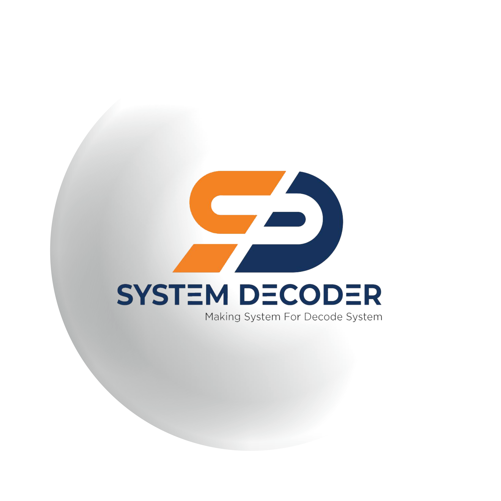

# System Decoder

## About Us

System Decoder is a cutting-edge technology company specializing in decoding and analyzing complex systems, protocols, and data formats. Our team of experts is dedicated to providing innovative solutions to decode, interpret, and understand various systems efficiently.

## Table of Contents

- [About Us](#about-us)
- [Services](#services)
- [Technologies](#technologies)
- [Getting Started](#getting-started)
- [Contributing](#contributing)
- [License](#license)
- [Contact Us](#contact-us)

## Services

At System Decoder, we offer a range of services to help you decode and analyze systems effectively:

- **System Decoding**: Decipher complex systems and protocols to understand their inner workings.
- **Protocol Analysis**: Analyze network protocols to identify vulnerabilities and optimize performance.
- **Data Format Interpretation**: Interpret various data formats to extract meaningful insights and patterns.
- **Custom Solutions**: Develop custom solutions tailored to your specific decoding and analysis needs.
- **Consulting Services**: Get expert advice and guidance on system decoding and analysis projects.

## Technologies

Our team at System Decoder utilizes a wide range of technologies to deliver cutting-edge solutions:

- Website design and Development
- Mobile application

## Getting Started

To learn more about our services and how we can help you decode and analyze systems, visit our website at [www.systemdecoder.com](https://www.systemdecoder.com).

## Contributing

Interested in contributing to System Decoder? We welcome contributions from the community! Whether it's through code contributions, bug reports, or feature requests, your input is valuable to us. Please see our [Contribution Guidelines](CONTRIBUTING.md) for more information.

## License

System Decoder projects are licensed under the [MIT License](LICENSE).

## Contact Us

If you have any questions, inquiries, or partnership opportunities, feel free to reach out to us:

- **Email**: contact@systemdecoder.com
- **Phone**: +8801995597666
- **Twitter**: [@SystemDecoder](https://twitter.com/systemdecoderbd)
- **LinkedIn**: [System Decoder](https://www.linkedin.com/company/systemdecoderbd)

We look forward to hearing from you!

